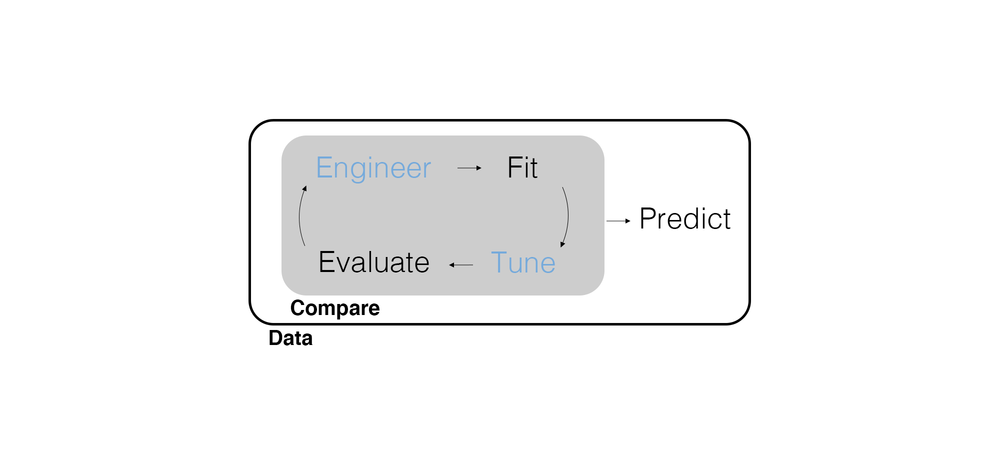

## Marketing Analytics Process

<center>
{width=900px}
</center>

## Predictive Modeling Workflow

<center>
{width=900px}
</center>

---

{width=850px}

## Let's Build Intuition for Random Forests

Guess my height!

## Random Forests

Why have one decision tree when you can have a *forest* of decision trees?

- A decision tree's branches result from rules on the predictor variables.
- In each dataset, there can be predictor variables that dominate.
- To avoid this, use a *random* subset of predictors for a given decision tree.
- Do this for a bunch of decision trees and combine the predictions of all trees.

This is a **random forest**. In general, the idea of combining the predictions of many models is known as an **ensemble**.

## Feature Engineering

- Install the `randomForest` package!
- Load the `tidyverse`, `tidymodels`, and `randomForest` packages.
- Set the randomization seed.
- Import the `roomba_survey` data.
- Create `segment` again with three categories.
- Select `segment` along with the related behaviors, shopping attitudes, gender, home type, neighborhood, marital status, and education predictors.
- Check our survey design and variable types - perform coercion as necessary.
- Split the data with `prop = 0.75` and `strata = segment`.

---

```{r message=FALSE, warning=FALSE, echo=FALSE}
# Load packages.
library(tidyverse)
library(tidymodels)
library(randomForest)

# Set randomization seed.
set.seed(42)
```

```{r message=FALSE, warning=FALSE}
# Import data, wrangle S1 into segment, and select predictors.
roomba_survey <- read_csv(here::here("Data", "roomba_survey.csv")) |> 
  rename(segment = S1) |> 
  mutate(
    segment = case_when(
      segment == 1 ~ "own",
      segment == 3 ~ "shopping",
      segment == 4 ~ "considering"
    ),
    segment = factor(segment)
  ) |> 
  select(
    segment, contains("RelatedBehaviors"), contains("ShoppingAttitudes"), 
    D1Gender, D2HomeType, D3Neighborhood, D4MaritalStatus, D6Education
  ) |>
  mutate(D2HomeType = factor(D2HomeType),
         D3Neighborhood = factor(D3Neighborhood),
         D4MaritalStatus = factor(D4MaritalStatus),
         D6Education = factor(D6Education))
```

---

```{r}
# Split data based on segment.
roomba_split <- initial_split(roomba_survey, prop = 0.75, strata = segment)

training(roomba_split)
```

---

We can use `.` for the predictors since we've selected everything we want in the previous step.

```{r}
# Feature engineering.
roomba_recipe <- training(roomba_split) |>
  recipe(
    segment ~ .
  ) |>
  # create dummy variables for all non-numeric variables! (exclude the outcome - 
  # we don't wan't dummies for segment)
  step_dummy(all_nominal(), -all_outcomes())

roomba_recipe
```

## Fit the Model

```{r}
# Set the model, engine, and mode.
rf_model_01 <- rand_forest() |> 
  set_engine(engine = "randomForest") |> 
  set_mode("classification")

rf_model_01
```

---

Create a workflow that combines the recipe and model and fit it.

```{r}
# Create a workflow.
rf_wf_01 <- workflow() |> 
  add_recipe(roomba_recipe) |> 
  add_model(rf_model_01)

# Fit the workflow.
rf_fit_01 <- fit(rf_wf_01, data = training(roomba_split))
```

## Evaluate Predictive Fit

For classification, accuracy on the testing data is a natural measure of predictive fit.

```{r}
# Compute model accuracy.
rf_fit_01 |> 
  predict(new_data = testing(roomba_split)) |>
  bind_cols(testing(roomba_split)) |>
  accuracy(truth = segment, estimate = .pred_class)
```

## Cross-Validation

What if we happened to get a `test` data set that was particularly difficult/easy to predict?

Similar to the idea of using multiple decision tree models (a random forest) to get a better prediction, let's repeatedly **resample** a subset of the training data, fit the model, and average the predictive accuracy to get a better understanding of our predictive fit.

This is called **cross-validation**. We split data into "folds" (subsections) and each fold is treated as testing data once. These pseudo-test data sets are called `validation` data sets. We are validating our model performance in each round of cross-validation.

---

Use v-fold cross-validation on the training data. Note the structure of the output. Each fold has it's own training and **validation** data split.

```{r}
# Use v-fold cross-validation based on segment.
roomba_cv <- vfold_cv(training(roomba_split), v = 10, strata = segment)

roomba_cv
```

---

Instead of `fit()`, we need a function made to deal with all of these *resamples*. Note this is actually a *for loop*. It might take a minute.

```{r}
# Fit the resampled training data.
cv_fit_01 <- fit_resamples(rf_wf_01, resamples = roomba_cv)
```

```{r}
cv_fit_01
```


---

Compute predictive fit across folds with a single function `collect_metrics()`.

```{r}
# Compute model accuracy.
cv_fit_01 |>
  collect_metrics() |>
  filter(.metric == 'accuracy')
```

---

With cross-validation and a random forest, we have an average of averages.

```{r}
# Look at the accuracy by fold.
cv_fit_01 |>
  collect_metrics(summarize = FALSE) |>
  filter(.metric == 'accuracy')
```

## Now if you REALLY Like Averages...

We can perform the cross-validation procedure multiple times and average all results. This produces a more stable estimate of model performance. By taking averages of averages, we are reducing the variance of the procedure.

```{r}
# Use repeated v-fold cross-validation based on segment.
roomba_cv_rep <- vfold_cv(training(roomba_split), v = 10, repeats = 5, strata = segment)

roomba_cv_rep
```

## Fit the resampled training data.

```{r}
cv_fit_01_rep <- fit_resamples(rf_wf_01, resamples = roomba_cv_rep)

# Compute model accuracy.
cv_fit_01_rep |>
  collect_metrics() |>
  filter(.metric == 'accuracy')
```

## Hyperparameter Tuning

Cross-validation is especially useful when trying to tune hyperparameters. If we use the testing data to tune hyperparameters, we run the risk of *overfitting*. Instead, we use the validation data.

What parameters will we tune for a random forest model?

- `mtry` number of predictors randomly sampled for each tree (default is the square root of the number of predictors)
- `trees` number of trees in the ensemble (default is 500)
- `min_n` minimum number of data points in a node to be split (default is 1)
  
---

```{r}
# Set the model, engine, and mode.
rf_model_02 <- rand_forest(mtry = tune(), trees = tune(), min_n = tune()) |> 
  set_engine(engine = "randomForest") |> 
  set_mode("classification")

rf_model_02
```

---

Instead of `fit_resamples()`, we need a function made to deal with the grid of all possible tuning parameters. Note this is a for loop within a for loop. It might take a *while*.

```{r message=FALSE}
# Update the workflow.
rf_wf_02 <- rf_wf_01 |> 
  update_model(rf_model_02)

# Tune the hyperparameters by using the cross-validation.
cv_fit_02 <- rf_wf_02 |> 
  tune_grid(resamples = roomba_cv)
```

---

The number of models we've just fit has *exploded*.

```{r}
# Look at the number of models!
cv_fit_02 |> 
  collect_metrics(summarize = FALSE) |>
  filter(.metric == 'accuracy')
```

---

We need to select the best one. Fortunately, there's a function for that.

```{r}
# Select the best fitting model.
cv_fit_best <- cv_fit_02 |> 
  select_best(metric = "accuracy")

cv_fit_best
```

---

```{r}
cv_fit_02 |> 
  collect_metrics(summarize = FALSE) |>
  filter(.metric == 'accuracy') |>
  group_by(.config) |>
  summarize(avg_accuracy = mean(.estimate)) |>
  arrange(desc(avg_accuracy))
```

## Did Our Cross-Validation Procedure Find us a Better Model?

---

Typically, we make our final model selection based on the validation data and then generate predictions. For the sake of building intuition, let's compare the performance of the best model from cross-validation to the model that uses the default hyperparameters.

```{r}
# Finalize the workflow that uses the best CV model
rf_wf_final <- rf_wf_02 |> 
  finalize_workflow(cv_fit_best)
  
rf_wf_final
```

---

Fit the final workflow on the entire training data and look at the predictive fit using the testing data without overfitting.

```{r}
# Fit the tuned workflow to the whole training dataset.
rf_fit_02 <- fit(rf_wf_final, data = training(roomba_split))

# Fit the original workflow using the model with 
# default hyperparameters to the whole training dataset.
rf_fit_03 <- fit(rf_wf_01, data = training(roomba_split))
```

---

```{r}
# Compute model accuracy.
rf_fit_02 |> 
  predict(new_data = testing(roomba_split)) |>
  bind_cols(testing(roomba_split)) |>
  accuracy(truth = segment, estimate = .pred_class)
```

---

```{r}
# Compute model accuracy.
rf_fit_03 |> 
  predict(new_data = testing(roomba_split)) |>
  bind_cols(testing(roomba_split)) |>
  accuracy(truth = segment, estimate = .pred_class)
```

## Wrapping Up

*Summary*

- Introduced random forests and ensembles.
- Did a walkthrough using cross-validation.
- Demonstrated cross-validation for hyperparameter tuning.

*Next Time*

- Deep learning.

*Supplementary Material*

- *Tidy Modeling with R* Chapters 12 and 13

## Exercise 17

Return to the previous exercise.

1. Try and improve on the predictive fit by using a random forest.
2. After fitting a random forest, use cross-validation and hyperparameter tuning on the random forest. Finalize the best-fitting model and compute predictive fit. Have you improved on the best-fitting model from Exercise 16?
3. Render the Quarto document into Word and upload to Canvas.

